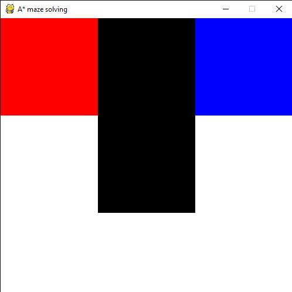

# A* Maze Solver
Create your own mazes and watch them be solved in real-time using the A* maze solving algorithm


## Installation
Install python and install the pygame library by running;

```pip install pygame```

## Quickstart
```python astar.py FILENAME [-optional]```

To run the demo maze shown run;

```python astar.py mazes/maze2.txt```

---

## Customisation
Values for the maze program can be changed in the config file & passed as optional parameters.

The properties that can be changed in `astar.ini` are;

- **Size**; The size of the window in pixels
- **Speed**; The speed the solving executes at
- **Colours**; Colours for all the screen elements can be customised in the format `R,G,B`

Size & Speed can also be overwridden as arguments by adding `-Size ___` and `-Speed ___` to the end of the `python astar.py FILE` command.

---

## How to create your own maze
Mazes are defined as text files with different characters representing different cells.

- `o` = Empty space
- `x` = Wall 
- `s` = Start
- `e` = End

For example the following text file;

```
sxe
oxo
ooo
```

Would produce the following maze;



More examples can be found in the mazes folder.
